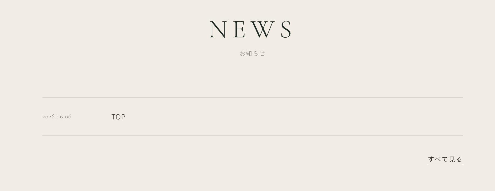

# WP COFFEE WordPress テキスト
## 静的サイトからWordPressテーマを作る実践ガイド

---

## 目次

- [はじめに](#intro)
- [Chapter 1 | 静的サイトをWordPressテーマ化しよう](#ch1)
- [Chapter 2 | お知らせをトップページに表示しよう](#ch2)
- [Chapter 3 | お知らせの詳細ページを作ろう](#ch3)
- [Chapter 4 | お知らせ一覧ページと表示設定を理解しよう](#ch4)
- [Chapter 5 | お知らせ一覧ページを作ろう（home.php）](#ch5)
- [Chapter 6 | カスタム投稿タイプで「メニュー」を管理しよう](#ch6)
- [Chapter 7 | カスタムフィールドでメニュー情報を管理しよう（ACF）](#ch7)
- [Chapter 8 | カスタムタクソノミーで「メニューカテゴリー」を作ろう](#ch8)
- [Chapter 9 | クラシックテーマをハイブリッドテーマにしよう](#ch9)
- [Chapter 10 | お問い合わせフォームを作ろう（Contact Form 7）](#ch10)
- [Chapter 11 | 404ページを作ろう](#ch11)
- [Chapter 12 | クライアントへの納品・サイト公開](#ch12)
- [付録](#appendix)

---

<a id="intro"></a>
## はじめに

### 5days講座で作るサイト

スペシャルティコーヒーショップ「WP COFFEE」のサイトをWordPressで動かします。

完成形のページ構成：

```
トップページ         … お知らせ3件 ＋ おすすめメニュー
メニュー一覧         … カスタム投稿タイプ「メニュー」の一覧
メニュー詳細         … 価格・産地・焙煎度などの情報
お知らせ一覧         … デフォルト投稿の一覧
お知らせ詳細         … 投稿詳細
こだわり（CONCEPT）   … ブロックエディターで管理するページ
お問い合わせ         … Contact Form 7
404ページ
```

### 使うもの

- Local（ローカルWordPress環境）
- VS Code などのテキストエディタ
- 配布ファイル：`wp-coffee/` フォルダ（静的HTML＋CSS）

### 配布ファイルの確認

```
wp-coffee/
├── index.html        ← トップページ
├── concept.html      ← こだわりページ
├── menu.html         ← メニュー一覧
├── menu-single.html  ← メニュー詳細
├── news.html         ← お知らせ一覧
├── news-single.html  ← お知らせ詳細
├── contact.html      ← お問い合わせ
├── story.html        ← ストーリー
├── access.html       ← アクセス
├── 404.html          ← 404ページ
└── style.css         ← スタイルシート
```

まず `index.html` をブラウザで開いてデザインを確認してください。
これをWordPressで動くように書き換えていきます。

---

<a id="ch1"></a>
## Chapter 1 | 静的サイトをWordPressテーマ化しよう

wp-coffee の静的HTMLをWordPressテーマとして動かします。

### 1-1. テーマフォルダを作る

Localで新しいサイトを作成後、テーマフォルダの中に `wp-coffee` フォルダを作ります。

```
（サイト名）/app/public/wp-content/themes/wp-coffee/
```

### 1-2. 作るファイルの全体像

```
wp-coffee/
├── style.css       ← テーマ情報（WordPressに認識させるためだけのファイル）
├── index.php       ← WordPressの必須ファイル（フォールバック用。このまま完成）
├── functions.php   ← テーマ設定・CSS読み込み
├── css/
│   └── style.css   ← 実際のスタイル（配布ファイルの style.css をここに置く）
├── header.php      ← <head>〜<header> の共通部分
├── footer.php      ← <footer>〜</html> の共通部分
├── front-page.php  ← トップページ
└── page.php        ← 固定ページ（Chapter 1 では「こだわり」をハードコード）
```

### 1-3. style.css と index.php を作る

**style.css**

`wp-coffee` 直下に `style.css` を作ります。テーマ情報だけを書きます。

```css
/*
Theme Name: WP COFFEE
*/
```

スタイルはここには書きません。実際のCSSは `css/style.css` で管理します。

**index.php（必須ファイル）**

WordPressは `style.css` と `index.php` の2ファイルがそろって初めてテーマとして認識します。  
`index.php` がないと管理画面のテーマ一覧に表示されません。

`wp-coffee` 直下に `index.php` を作り、以下を書きます。

```php
<?php get_header(); ?>

<main>
  <div class="page-eyebrow">
    <h1 class="page-eyebrow__en">NOT FOUND</h1>
    <p class="page-eyebrow__ja">ページが見つかりません</p>
  </div>
  <section>
    <div class="container" style="padding:4rem 1rem; text-align:center;">
      <p><a href="<?php echo esc_url( home_url( '/' ) ); ?>">トップページへ戻る</a></p>
    </div>
  </section>
</main>

<?php get_footer(); ?>
```

`index.php` はWordPressのテンプレート階層の**最終フォールバック**です。  
`front-page.php` / `home.php` / `single.php` / `page.php` / `404.php` のいずれも該当しないURLに使われます。  
お知らせ一覧は Chapter 9 で `home.php` として作るため、このファイルはこれで完成です。

### 1-4. functions.php を作る

`functions.php` はテーマの「エンジンルーム」。テーマ設定・スタイルの読み込みをここにまとめて書きます。

**フック（hook）とは**

WordPressは処理の各所に「フック」という割り込みポイントを用意しています。
`add_action( 'フック名', '実行する関数名' )` と書くと、そのタイミングで関数を呼び出せます。

```
WordPress の処理の流れ
  ↓
after_setup_theme  ←── ここで wpcoffee_setup() が割り込む
  ↓
wp_enqueue_scripts ←── ここで wpcoffee_enqueue_styles() が割り込む
  ↓
ページ出力（wp_head() が <link> タグを出力する）
```

```php
<?php

// ① テーマ基本設定 ----------------------------------------
function wpcoffee_setup() {

  // <title> タグの出力を WordPress に任せる
  // → header.php に <title>...</title> を直書きしなくて済む
  // → SEO プラグインがタイトルを書き換えられるようになる
  add_theme_support( 'title-tag' );

  // アイキャッチ画像（サムネイル）の設定欄を管理画面に表示する
  // → これがないと投稿編集画面に「アイキャッチ画像」が現れない
  add_theme_support( 'post-thumbnails' );

  // 検索フォームなどの出力を HTML5 形式にする
  add_theme_support( 'html5', [
    'search-form', 'comment-form', 'comment-list', 'gallery', 'caption',
  ] );

}
// after_setup_theme : テーマファイルが読み込まれた直後に実行されるフック
// テーマの初期設定はすべてここにまとめて書くのが慣習
add_action( 'after_setup_theme', 'wpcoffee_setup' );


// ② CSS の読み込み ----------------------------------------
function wpcoffee_enqueue_styles() {
  wp_enqueue_style(
    'wpcoffee-style',                     // ハンドル名：他のスタイルと区別するための識別子
    get_theme_file_uri( 'css/style.css' ) // ファイルの URL
  );
}
// wp_enqueue_scripts : フロント側の <head> を出力する直前に実行されるフック
// wp_head() がこのフックで登録された CSS を <link> タグとして出力する
add_action( 'wp_enqueue_scripts', 'wpcoffee_enqueue_styles' );
```

**`get_theme_file_uri()` を使う理由**

`get_template_directory_uri()` も同じくテーマフォルダのURLを返しますが、子テーマがある場合の挙動が異なります。

| 関数 | 子テーマがある場合の動作 |
|---|---|
| `get_template_directory_uri()` | 常に**親テーマ**の URL を返す |
| `get_theme_file_uri()` | 子テーマに同名ファイルがあれば子テーマを優先する |

特別な理由がなければ `get_theme_file_uri()` を使う習慣にしておく（3DAYS で解説済み）。

---
ここでいったんテーマを有効化しておきましょう！
---

### 1-6. front-page.php を作る

まず `index.html` の内容を丸ごと `front-page.php` として作成します。この時点ではヘッダー・フッターを含む1ファイル構成です。WordPress 関数を組み込みながら書いていきましょう。

NEWSとFEATURED MENUは後の章でWordPress化するため、今はHTML静的のままにしておきます。

### 1-7. header.php を切り出す

`front-page.php` の `<!DOCTYPE html>` から `</header>` までを **`header.php`** として切り出します。

ヘッダーはトップページ以外でも共通で使うパーツです。別ファイルに分けることで、どのテンプレートファイルからでも `<?php get_header(); ?>` の1行で呼び出せるようになります。

**新規作成: header.php**

```php
<!DOCTYPE html>
<html <?php language_attributes(); ?>>
<head>
  <meta charset="<?php bloginfo( 'charset' ); ?>">
  <meta name="viewport" content="width=device-width, initial-scale=1.0">
  <?php wp_head(); ?>
</head>
<body <?php body_class(); ?>>
<?php wp_body_open(); ?>

<header class="site-header<?php if ( ! is_front_page() ) echo ' is-filled'; ?>">
  <a class="site-logo" href="<?php echo esc_url( home_url( '/' ) ); ?>">
    WP<span class="site-logo__sub">COFFEE</span>
  </a>
  <nav class="site-nav">
    <ul class="site-nav__items">
      <li><a href="<?php echo esc_url( home_url( '/menu/' ) ); ?>">MENU</a></li>
      <li><a href="<?php echo esc_url( home_url( '/concept/' ) ); ?>">CONCEPT</a></li>
      <li><a href="<?php echo esc_url( home_url( '/news/' ) ); ?>">NEWS</a></li>
      <li><a href="<?php echo esc_url( home_url( '/contact/' ) ); ?>">CONTACT</a></li>
    </ul>
  </nav>
</header>
```

**`<?php wp_head(); ?>` は必須**

`</head>` の直前に必ず書きます。プラグインのCSSやmeta情報はここから出力されます。書き忘れると多くのプラグインが正常に動作しなくなります。

`is_front_page()` はトップページかどうかを返す関数。header.php はすべてのページで使われるため、ここでページを判定してヘッダーのスタイルを切り替えます。

**front-page.php の該当箇所を置き換える**

`front-page.php` の `<!DOCTYPE html>` から `</header>` までを削除し、冒頭に `<?php get_header(); ?>` を書きます。

```php
<?php get_header(); ?>

<main>
  ...
```

### 1-8. footer.php を切り出す

同様に、`front-page.php` の `<footer>` から `</html>` までを **`footer.php`** として切り出します。

**新規作成: footer.php**

```php
<footer class="site-footer">
  <div class="footer-inner">
    <div class="footer-brand">
      <p class="footer-logo">WP<span class="footer-logo__sub">COFFEE</span></p>
      <p class="footer-tagline">豆のすべてを、一杯に。<br>スペシャルティコーヒーの専門店</p>
      <address class="footer-address">
        東京都渋谷区〇〇町 1-2-3<br>
        TEL 03-0000-0000<br>
        営業時間 9:00–19:00（水曜定休）
      </address>
    </div>
    <nav class="footer-nav-grid">
      <div class="footer-nav-group">
        <p class="footer-nav-group__heading">ABOUT</p>
        <ul class="footer-nav-group__items">
          <li><a href="<?php echo esc_url( home_url( '/concept/' ) ); ?>">こだわり</a></li>
          <li><a href="<?php echo esc_url( home_url( '/story/' ) ); ?>">ストーリー</a></li>
        </ul>
      </div>
      <div class="footer-nav-group">
        <p class="footer-nav-group__heading">MENU</p>
        <ul class="footer-nav-group__items">
          <li><a href="<?php echo esc_url( get_post_type_archive_link( 'menu' ) ); ?>">メニュー一覧</a></li>
        </ul>
      </div>
      <div class="footer-nav-group">
        <p class="footer-nav-group__heading">VISIT</p>
        <ul class="footer-nav-group__items">
          <li><a href="<?php echo esc_url( home_url( '/access/' ) ); ?>">アクセス</a></li>
          <li><a href="<?php echo esc_url( home_url( '/contact/' ) ); ?>">お問い合わせ</a></li>
        </ul>
      </div>
    </nav>
  </div>
  <p class="footer-copy">© <?php echo date( 'Y' ); ?> WP COFFEE. All rights reserved.</p>
</footer>

<?php wp_footer(); ?>
</body>
</html>
```

**`<?php wp_footer(); ?>` は必須**

`</body>` の直前に必ず書きます。プラグインのJavaScriptはここから出力されます。`wp_head()` と `wp_footer()` の2つが揃って初めてプラグインが正常に動作します。

**front-page.php の該当箇所を置き換える**

`front-page.php` の `<footer>` から `</html>` までを削除し、末尾に `<?php get_footer(); ?>` を書きます。

```php
  ...
</main>

<?php get_footer(); ?>
```

これで `front-page.php` は `get_header()` と `get_footer()` で挟まれた、`<main>` だけのすっきりした構成になります。


### 1-10. page-concept.php を作る

配布済みの静的HTML `concept.html` をテーマフォルダにコピーし、`page-concept.php` にリネームします。  
スラッグが `concept` の固定ページには、`page.php` より優先してこのファイルが使われます（テンプレート階層の仕組みは 1-11 で詳しく説明します）。

リネームしたら、ファイルの内容を次のように書き換えます。

- `<!DOCTYPE html>` から `</header>` → `<?php get_header(); ?>` に置き換え
- `<footer>` から `</html>` → `<?php get_footer(); ?>` に置き換え

完成した `page-concept.php` は次のとおりです。

```php
<?php get_header(); ?>

<main>

  <div class="page-eyebrow">
    <h1 class="page-eyebrow__en">CONCEPT</h1>
    <p class="page-eyebrow__ja">こだわり</p>
    <p class="page-eyebrow__lead">豆に、正直に。</p>
  </div>

  <section class="split split--dark">
    <div class="split__inner">
      <figure class="split__fig"></figure>
      <div class="split__body">
        <p class="split__num">01</p>
        <h2 class="split__heading">産地との対話</h2>
        <span class="split__heading-sub">ORIGIN</span>
        <p>WP COFFEEの豆選びは、農園への訪問から始まります。現地の土壌、気候、農家の哲学——そのすべてを理解した上で、年間を通じて仕入れる豆を決定します。</p>
      </div>
    </div>
  </section>

  <section class="split split--light">
    <div class="split__inner split__inner--flip">
      <figure class="split__fig"></figure>
      <div class="split__body">
        <p class="split__num">02</p>
        <h2 class="split__heading">少量焙煎の誠実さ</h2>
        <span class="split__heading-sub">ROASTING</span>
        <p>焙煎は毎日少量ずつ、豆の状態に合わせて温度と時間を調整しながら行います。焙煎士が一バッチごとに向き合い、納得のいく一焼きだけをお届けします。</p>
      </div>
    </div>
  </section>

  <section class="split split--dark">
    <div class="split__inner">
      <figure class="split__fig"></figure>
      <div class="split__body">
        <p class="split__num">03</p>
        <h2 class="split__heading">一杯への集中</h2>
        <span class="split__heading-sub">BREWING</span>
        <p>抽出は、豆・水・温度・時間のバランスで決まります。バリスタは毎朝グラインドの粒度と湯温を確認し、その日のコンディションに合わせて微調整します。</p>
      </div>
    </div>
  </section>

</main>

<?php get_footer(); ?>
```

管理画面 → 固定ページ → 新規追加 → タイトル「こだわり」・スラッグ `concept` で公開。  
ブラウザで `http://サイトURL/concept/` にアクセスして確認します。

✅ こだわりページが表示されている

### 1-11. その他の固定ページテンプレートを作る

`page-concept.php` と同じ手順で残りの固定ページを作成します。

| 作成するファイル | 元の静的HTML | 固定ページのスラッグ |
|---|---|---|
| `page-story.php` | `story.html` | `story` |
| `page-space.php` | `space.html` | `space` |

各ページの手順：

① 静的HTMLをテーマフォルダにコピーしてファイル名を変更（例：`story.html` → `page-story.php`）  
② `<!DOCTYPE html>` から `</header>` までを削除し、1行目に `<?php get_header(); ?>` を書く  
③ `<footer class="site-footer">` から `</html>` までを削除し、末尾に `<?php get_footer(); ?>` を書く  
④ 管理画面 → 固定ページ → 新規追加 → タイトルとスラッグを設定して公開  
⑤ ブラウザで確認  

お問い合わせページ（`page-contact.php`）は Chapter 10 で Contact Form 7 と合わせて作成します。

### 1-12. 画像ファイルをテーマに配置する

静的HTMLの `` タグには `src="images/..."` という相対パスが書かれています。  
このままPHPテンプレートに貼り付けると、WordPress環境ではパスが解決できずに画像が表示されません。

**images/ フォルダをテーマにコピーする**

静的サイトの `images/` フォルダをテーマフォルダにそのままコピーします。

```
wp-coffee/（テーマフォルダ）
├── images/
│   └── concept/
│       ├── origin.jpg
│       ├── roasting.jpg
│       └── brewing.jpg
└── （その他のファイル）
```

**`` の src を `get_theme_file_uri()` に書き換える**

`get_theme_file_uri()` はテーマフォルダの絶対URLを返す関数です。  
静的HTMLの相対パスをこの関数に置き換えることで、ローカルと本番どちらでも正しく画像が表示されます。

```php
<!-- 静的HTML（相対パスのまま → WordPress では壊れる） -->


<!-- WordPress テンプレート（get_theme_file_uri() で絶対URL を生成） -->
" alt="コーヒー農園での収穫">
```

**page-concept.php の `` src を書き換える**

concept.html からコピーした `page-concept.php` 内の3か所を書き換えます。

```php
<!-- 01 産地との対話 -->
<figure class="split__fig">
  " alt="コーヒー農園での収穫">
</figure>

<!-- 02 少量焙煎の誠実さ -->
<figure class="split__fig">
  " alt="コーヒー焙煎機と豆">
</figure>

<!-- 03 一杯への集中 -->
<figure class="split__fig">
  " alt="ハンドドリップ抽出">
</figure>
```

**トップページについて**

`front-page.php`（index.html）のヒーローセクションとCONCEPTテイザーは、`` タグを使わずCSSグラデーションで表現されています。`css/style.css` に外部画像ファイルへの参照もないため、トップページは対応不要です。

✅ こだわりページの各セクションに写真が表示されている

---

<a id="ch2"></a>
## Chapter 2 | お知らせをトップページに表示しよう

WordPressのデフォルト投稿（お知らせ）をトップページのNEWSセクションに表示します。

### 2-1. お知らせ記事を入れる

管理画面 → 投稿 → 新規追加で3件ほど記事を作成してください。  
カテゴリー（INFO / EVENTなど）も設定しておくと確認しやすくなります。

### 2-2. front-page.php の NEWSセクションをループに書き換える

`front-page.php` のNEWSセクション（`<ul class="news-list">` の中身）を以下に書き換えます。

```php
<!-- NEWS -->
<section class="block-news">
  <div class="container">
    <header class="section-head">
      <h2 class="section-head__en">NEWS</h2>
      <p class="section-head__ja">お知らせ</p>
    </header>
    <ul class="news-list">

      <!-- ① 静的な <li> 1件 → WordPressループに置き換え -->
      <?php if ( have_posts() ) : ?>
        <?php while ( have_posts() ) : the_post(); ?>
          <?php $cats = get_the_category(); ?>
          <li class="news-item">
            <!-- ② href="#" → 各投稿のURL -->
            <a class="news-item__link" href="<?php the_permalink(); ?>">
              <!-- ③ 固定の日付テキスト → 投稿日 -->
              <time class="news-item__date" datetime="<?php echo get_the_date( 'Y-m-d' ); ?>"><?php echo get_the_date( 'Y.m.d' ); ?></time>
              <!-- ④ 固定の「INFO」テキスト → 投稿カテゴリー名 -->
              <?php if ( $cats ) : ?>
              <span class="news-item__tag"><?php echo esc_html( $cats[0]->name ); ?></span>
              <?php endif; ?>
              <!-- ⑤ 固定のタイトルテキスト → 投稿タイトル -->
              <span class="news-item__title"><?php the_title(); ?></span>
            </a>
          </li>
        <?php endwhile; ?>
      <?php endif; ?>
      <!-- ループ終了 -->

    </ul>
    <p class="more-link"><a href="#">すべて見る</a></p>
  </div>
</section>
```

**① ループ** — 静的HTMLでは `<li>` が1件しかなかった部分を `have_posts()` / `the_post()` のループに置き換えます。投稿が存在する間だけ `<li>` を繰り返し出力します。

**② `the_permalink()`** — 静的の `href="#"` を置き換えます。現在の投稿のURLを返します。

**③ `get_the_date()`** — 静的な日付テキスト（`2026.05.20`）を置き換えます。引数にフォーマットを渡すことができ、`datetime` 属性用の `'Y-m-d'` とテキスト表示用の `'Y.m.d'` を使い分けています。

**④ `get_the_category()`** — 静的な `INFO` テキストを置き換えます。投稿に紐づくカテゴリーを配列で返します。複数カテゴリーが付いている場合も `[0]` で最初の1件を取得しています。

**⑤ `the_title()`** — 静的なタイトルテキストを置き換えます。現在の投稿のタイトルをそのまま出力します。

保存してブラウザを更新すると、管理画面で入力した投稿が表示されます。

✅ トップページにWordPressの投稿が表示されている

---

<a id="ch3"></a>
## Chapter 3 | お知らせの詳細ページを作ろう

`news-single.html` をベースに `single.php` を作ります。  
静的HTMLのどこをWordPress関数に置き換えるかを確認しながら進めます。

### 3-1. news-single.html の構造を確認する

`news-single.html` を開いてください。`<main>` の中は以下の構造になっています。

```html
      <!-- ① ヘッダー情報（日付・カテゴリー・タイトル） -->
      <header class="article-header">
        <div class="article-meta">
          <time datetime="2026-05-20">2026.05.20</time>  ← 日付（固定）
          <span class="article-cat">INFO</span>          ← カテゴリー（固定）
        </div>
        <h1 class="article-title">夏季限定コールドブリューのご案内</h1>  ← タイトル（固定）
      </header>

      <!-- ② アイキャッチ画像（プレースホルダー） -->
      <figure class="article-thumb">
        <div class="ph">PHOTO</div>
      </figure>

      <!-- ③ 本文（固定テキスト） -->
      <div class="article-body">
        <p>6月1日（月）より、夏季限定の「コールドブリュー」の提供を...</p>
        ...
      </div>

      <!-- ④ 前後ナビ（固定リンク） -->
      <nav class="article-nav">
        <a class="article-nav__item" href="news-single.html">...</a>
        <a class="article-nav__item" href="news-single.html">...</a>
      </nav>

```

### 3-2. 何をWordPress関数に置き換えるか

| 静的HTML（固定値） | WordPress関数（動的） | 関数の説明 |
|---|---|---|
| `2026-05-20` / `2026.05.20`（日付） | `get_the_date( 'Y-m-d' )` / `get_the_date( 'Y.m.d' )` | 投稿日を指定フォーマットで返す |
| `INFO`（カテゴリー名） | `get_the_category()` | 投稿のカテゴリーを配列で返す。`[0]->name` で最初のカテゴリー名を取得 |
| タイトルテキスト（記事名） | `the_title()` | 投稿タイトルをそのまま出力する |
| `<div class="ph">PHOTO</div>` | `the_post_thumbnail( 'large' )` | アイキャッチ画像の `` タグを出力する。引数はサイズ |
| 本文テキスト | `the_content()` | 投稿本文をHTMLとして出力する |
| 前後リンクのURL・タイトル | `get_previous_post()` / `get_next_post()` | 前後の投稿オブジェクトを返す。`get_permalink()` や `get_the_title()` と組み合わせて使う |

### 3-3. single.php を作る

① `news-single.html` の内容を丸ごとコピーして `single.php` という名前で保存する  
② `<!DOCTYPE html>` から `</header>` までを削除し、1行目に `<?php get_header(); ?>` を書く  
③ `<footer class="site-footer">` から `</html>` までを削除し、末尾に `<?php get_footer(); ?>` を書く  
④ `<main>` の直後にWordPressのループを開始し、`</main>` の前に閉じる  
⑤ 各要素をWordPress関数に置き換える

完成した `single.php`：

```php
<?php get_header(); ?>

<main>
<?php if ( have_posts() ) : while ( have_posts() ) : the_post(); ?>

  <section class="article-wrap">
    <div class="container" style="max-width:720px;">

      <!-- ① ヘッダー情報（日付・カテゴリー・タイトル） -->
      <header class="article-header">
        <div class="article-meta">
          <!-- 日付：datetime属性とテキストをそれぞれ別フォーマットで出力 -->
          <time class="article-date" datetime="<?php echo get_the_date( 'Y-m-d' ); ?>"><?php echo get_the_date( 'Y.m.d' ); ?></time>
          <!-- カテゴリー：配列で返るので [0] で最初の1件を取得 -->
          <?php $cats = get_the_category(); ?>
          <?php if ( $cats ) : ?>
          <span class="article-cat"><?php echo esc_html( $cats[0]->name ); ?></span>
          <?php endif; ?>
        </div>
        <h1 class="article-title"><?php the_title(); ?></h1>
      </header>

      <!-- ② アイキャッチ画像（設定されている場合のみ表示） -->
      <?php if ( has_post_thumbnail() ) : ?>
      <figure class="article-thumb">
        <?php the_post_thumbnail( 'large' ); ?>
      </figure>
      <?php endif; ?>

      <!-- ③ 本文 -->
      <div class="article-body">
        <?php the_content(); ?>
      </div>

      <!-- ④ 前後ナビ -->
      <nav class="article-nav">
        <?php
        $prev = get_previous_post();
        $next = get_next_post();
        ?>
        <?php if ( $prev ) : ?>
        <a class="article-nav__item" href="<?php echo esc_url( get_permalink( $prev ) ); ?>">
          <p class="article-nav__label">← PREV</p>
          <p class="article-nav__title"><?php echo esc_html( get_the_title( $prev ) ); ?></p>
        </a>
        <?php else : ?>
        <div class="article-nav__item"></div>
        <?php endif; ?>
        <?php if ( $next ) : ?>
        <a class="article-nav__item" href="<?php echo esc_url( get_permalink( $next ) ); ?>" style="text-align:right;">
          <p class="article-nav__label">NEXT →</p>
          <p class="article-nav__title"><?php echo esc_html( get_the_title( $next ) ); ?></p>
        </a>
        <?php else : ?>
        <div class="article-nav__item"></div>
        <?php endif; ?>
      </nav>

    </div>
  </section>

<?php endwhile; endif; ?>
</main>

<?php get_footer(); ?>
```

#### 「前後ナビ」のコードについて、ちょっと補足解説です！

```php
$prev = get_previous_post();
$next = get_next_post();
```

`the_post()` で現在の記事の情報を取得したのと同じように、`get_previous_post()` / `get_next_post()` で前後の記事の情報を取得します。投稿がなければ `false` が返ります。

```php
<?php if ( $prev ) : ?>
<a href="<?php echo esc_url( get_permalink( $prev ) ); ?>">
  <?php echo esc_html( get_the_title( $prev ) ); ?>
</a>
<?php endif; ?>
```

`$prev` に投稿が入っていれば `<a>` を出力します。  
取得した記事の情報に対して `get_permalink()` でURL、`get_the_title()` でタイトルを取得できます。  
投稿がないとき（最初・最後の記事）は空の `<div>` を置いてレイアウトを崩さないようにしています。

✅ お知らせ一覧のリンクをクリックすると詳細ページが表示される  
✅ 投稿日・カテゴリー・タイトル・本文が表示されている  
✅ 前後ナビのリンクが機能している

---

<a id="ch4"></a>
## Chapter 4 | 表示設定・メインクエリとサブクエリを理解しよう

「トップページを固定ページにする」という実務でよく使う設定を行い、メインクエリとサブクエリの違いを理解します。  
お知らせ一覧ページは Chapter 9 で `home.php` として作ります。

### 4-1. 固定ページをトップページに設定する

実務では「最新の投稿」をトップに表示する設定ではなく、固定ページをトップにするのが標準です。

① 管理画面 → 固定ページ → 新規追加 → タイトル「TOP」のページを作成（本文は空でOK）  
② 管理画面 → 設定 → 表示設定  
③ 「ホームページの表示」を「固定ページ」に変更  
④ 「ホームページ」に「TOP」を選択して保存

✅ トップページを開くと `front-page.php` が使われている（ページタイトルが「TOP」ではなくデザインが表示されている）

### 4-2. メインクエリとサブクエリを理解する

表示設定を変えたことで、`front-page.php` の `have_posts()` がお知らせを返さなくなっています。



なぜなのか...!!!!!

#### 【大切】まずはメインクエリ・サブクエリをざっと理解しておきましょう

- **メインクエリ**：アクセスされたURLをWordPressが解析して、自動的に取得してくるもの。  
- **サブクエリ（WP_Query）**：メインクエリとは別に、表示したい情報を自分で指示して取得するもの。

.

そして設定の表示設定によって**トップページのメインクエリが変わる**のであります！

| 表示設定 | メインクエリが返すもの |
|---|---|
| 最新の投稿 | デフォルト投稿（お知らせ）一覧 |
| 固定ページ | 指定した固定ページ1件のコンテンツ |

.

`front-page.php` の `have_posts()` はメインクエリを使うため、固定ページが指定されるとお知らせを返さなくなります。

**解決策：WP_Query（サブクエリ）を使う。**  
サブクエリは取得条件を自分で書くため、表示設定に関係なく常に指定した内容を取得できます。

### 4-3. front-page.php の NEWSセクションを WP_Query に書き換える

```php
<!-- NEWS -->
<section class="block-news">
  <div class="container">
    <header class="section-head">
      <h2 class="section-head__en">NEWS</h2>
      <p class="section-head__ja">お知らせ</p>
    </header>
    <ul class="news-list">
      <?php
      /* ↓ 書き換え①：メインクエリの have_posts() → WP_Query に変更 */
      $news_query = new WP_Query( [
        'post_type'      => 'post',
        'posts_per_page' => 3,
      ] );
      /* ↓ 書き換え②：have_posts() / the_post() → $news_query-> に変更 */
      if ( $news_query->have_posts() ) :
        while ( $news_query->have_posts() ) : $news_query->the_post();
          $cats = get_the_category();
      ?>
        <li class="news-item">
          <a class="news-item__link" href="<?php the_permalink(); ?>">
            <time class="news-item__date" datetime="<?php echo get_the_date( 'Y-m-d' ); ?>"><?php echo get_the_date( 'Y.m.d' ); ?></time>
            <?php if ( $cats ) : ?>
            <span class="news-item__tag"><?php echo esc_html( $cats[0]->name ); ?></span>
            <?php endif; ?>
            <span class="news-item__title"><?php the_title(); ?></span>
          </a>
        </li>
      <?php
        endwhile;
        /* 書き換え③：サブクエリ使用後に追加 */
        wp_reset_postdata(); 
      endif;
      ?>
    </ul>
    <p class="more-link"><a href="#">すべて見る</a></p>
  </div>
</section>
```

`wp_reset_postdata()` はサブクエリを使ったあとに必ず書く。これを書かないとメインクエリの状態が狂い、後続のコードに影響する。

✅ トップページにお知らせ3件が表示されている  
✅ 「すべて見る」リンクがお知らせ一覧ページに飛ぶ（Chapter 9 で home.php として完成させる）

---

<a id="ch5"></a>
## Chapter 5 | お知らせ一覧ページを作ろう（home.php）

「投稿ページ」に設定した固定ページを正しいテンプレートで表示します。

### 5-1. home.php を用意する

お知らせ一覧は WordPress の「デフォルトの投稿」を使って作ります。デフォルトの投稿の一覧ページは `home.php` で作ります。

① 静的HTMLの `news.html` をテーマフォルダにコピーして `home.php` にリネームする  
② `<!DOCTYPE html>` から `</header>` までを削除し、1行目に `<?php get_header(); ?>` を書く  
③ `<footer class="site-footer">` から `</html>` までを削除し、末尾に `<?php get_footer(); ?>` を書く

ただし `home.php` を機能させるには、WordPress に「どの固定ページが投稿一覧ページなのか」を教える必要があります。そのため、まず投稿一覧用の固定ページを作成し、管理画面の「表示設定」でそのページを「投稿ページ」として登録する手順を踏みます。

### 5-2. 「投稿ページ」用の固定ページを作る

管理画面 → 固定ページ → 新規追加 → タイトル「お知らせ」・スラッグ `news` で作成。  
管理画面 → 設定 → 表示設定 → 「投稿ページ」に「お知らせ」を設定して保存。

### 5-3. home.php を作る

```php
<?php get_header(); ?>

<main>
  <div class="page-eyebrow">
    <h1 class="page-eyebrow__en">NEWS</h1>
    <p class="page-eyebrow__ja">お知らせ</p>
  </div>

  <section class="block-news">
    <div class="container">
      <ul class="news-list">
        <?php if ( have_posts() ) : while ( have_posts() ) : the_post();
          $cats = get_the_category();
        ?>
          <li class="news-item">
            <a class="news-item__link" href="<?php the_permalink(); ?>">
              <time class="news-item__date" datetime="<?php echo get_the_date( 'Y-m-d' ); ?>"><?php echo get_the_date( 'Y.m.d' ); ?></time>
              <?php if ( $cats ) : ?>
              <span class="news-item__tag"><?php echo esc_html( $cats[0]->name ); ?></span>
              <?php endif; ?>
              <span class="news-item__title"><?php the_title(); ?></span>
            </a>
          </li>
        <?php endwhile; endif; ?>
      </ul>

      <nav class="pagination">
        <?php
        the_posts_pagination( [
          'mid_size'  => 1,
          'prev_text' => '←',
          'next_text' => '→',
        ] );
        ?>
      </nav>
    </div>
  </section>
</main>

<?php get_footer(); ?>
```

ループ部分（`have_posts()` / `the_post()`）はトップページの `front-page.php` で書いたメインクエリのループと同じ書き方です。`home.php` ではメインクエリが自動的にお知らせ一覧を返すので、サブクエリは必要ありません。

#### ページネーションを分解する

```php
the_posts_pagination( [
  'mid_size'  => 1,
  'prev_text' => '←',
  'next_text' => '→',
] );
```

`the_posts_pagination()` はWordPressが用意しているページネーション出力関数です。引数で表示の細かい設定ができます。

| 引数 | 意味 |
|---|---|
| `mid_size` | 現在のページの前後に何件のページ番号を表示するか |
| `prev_text` | 「前のページ」リンクのテキスト |
| `next_text` | 「次のページ」リンクのテキスト |

表示件数は管理画面 → 設定 → 表示設定 → 「1ページに表示する最大投稿数」で変更できます。

`front-page.php` の「すべて見る」リンクを書き換えます。

```php
/* 変更前 */
<p class="more-link"><a href="#">すべて見る</a></p>

/* 変更後 */
<p class="more-link"><a href="/news/">すべて見る</a></p>
```

✅ `/news/` にアクセスするとお知らせ一覧が表示される  
✅ トップページの「すべて見る」リンクが `/news/` に飛ぶ

---

## Chapter 5.5 | ヘッダーのリンクを整える

Chapter 1 で作成した `header.php` のリンクをここで見直します。  
これまでのChapterでページの仕組みが整ったので、各リンクの状態を確認して修正します。

### 5.5-1. 現在のヘッダーリンクの状態を確認する

現在の `header.php` のナビ部分：

```php
<ul class="site-nav__items">
  <li><a href="<?php echo esc_url( home_url( '/menu/' ) ); ?>">MENU</a></li>
  <li><a href="<?php echo esc_url( home_url( '/concept/' ) ); ?>">CONCEPT</a></li>
  <li><a href="<?php echo esc_url( home_url( '/news/' ) ); ?>">NEWS</a></li>
  <li><a href="<?php echo esc_url( home_url( '/contact/' ) ); ?>">CONTACT</a></li>
</ul>
```

| リンク | 現在の状態 | 備考 |
|---|---|---|
| MENU | `home_url('/menu/')` | Chapter 6 でカスタム投稿タイプを登録すると動作する |
| CONCEPT | `home_url('/concept/')` | ✅ 動作している |
| NEWS | `home_url('/news/')` | ✅ 動作している |
| CONTACT | `home_url('/contact/')` | Chapter 10 でテンプレートを作ると動作する |

### 5.5-2. ロゴのリンクをトップページに変更する

静的HTMLのロゴリンクは `href="index.html"` と直書きされています。  
WordPress では `home_url('/')` でサイトのトップURLを動的に取得できるので書き換えます。

`header.php` のロゴ部分：

```php
<!-- 変更前（静的HTML） -->
<a class="site-logo" href="index.html">
  WP<span class="site-logo__sub">COFFEE</span>
</a>

<!-- 変更後 -->
<a class="site-logo" href="<?php echo esc_url( home_url( '/' ) ); ?>">
  WP<span class="site-logo__sub">COFFEE</span>
</a>
```

`home_url('/')` はサイトのトップURLを返します。ローカルでも本番でも正しいURLが生成されるため、URLを直書きする必要がなくなります。

### 5.5-3. MENUリンクの予告

MENUリンクは Chapter 6 でカスタム投稿タイプ「menu」を登録した後、`get_post_type_archive_link('menu')` に更新します。  
今は `home_url('/menu/')` のままにしておきます。

✅ ロゴをクリックするとトップページに戻る

---

<a id="ch6"></a>
## Chap ter 6 | カスタム投稿タイプで「メニュー」を管理しよう

コーヒーショップのメニューを専用の投稿タイプで管理します。

### 6-1. カスタム投稿タイプとは

WordPressには「投稿（post）」「固定ページ（page）」という2種類のコンテンツがある。  
メニューを「投稿」に入れると、お知らせと混在してしまう。

```
投稿一覧（混在してしまう例）
├── 夏季限定コールドブリューのご案内   ← お知らせ
├── シングルオリジン エスプレッソ     ← メニュー（混ざってる！）
└── 産地別テイスティングイベント       ← お知らせ
```

カスタム投稿タイプを作ると、種類ごとに完全に分けて管理できる。

```
投稿（お知らせ）                   メニュー（カスタム投稿タイプ）
├── 夏季限定コールドブリューのご案内   ├── シングルオリジン エスプレッソ
└── 産地別テイスティングイベント       ├── オーツミルク ラテ
                                    └── ハンドドリップ コーヒー
```

### 6-2. カスタム投稿タイプ「menu」を登録する

プラグイン **Custom Post Type UI（CPT UI）** を使って登録します。

管理画面 → プラグイン → 新規追加 → 「Custom Post Type UI」を検索してインストール・有効化。

有効化後、管理画面に「CPT UI」メニューが追加されます。  
CPT UI → 投稿タイプの追加と編集 → 以下の設定で登録します。

| 項目 | 値 |
|---|---|
| 投稿タイプスラッグ | `menu` |
| 複数形のラベル | `メニュー` |
| 単数形のラベル | `メニュー` |
| アーカイブあり | true |
| アイコン | `dashicons-coffee` |

「サポート」は「タイトル」「アイキャッチ画像」「抜粋」にチェックを入れます。

「投稿タイプを追加」ボタンをクリックして保存します。

保存後、管理画面の左メニューに「メニュー」が追加されます。  
メニュー記事を3〜5件入力してください（タイトル・アイキャッチ・抜粋を入れる）。

✅ 管理画面の左メニューに「メニュー」が表示されている

**パーマリンクのリセット（必須）：** カスタム投稿タイプを登録したら、  
管理画面 → 設定 → パーマリンク設定 → 「変更を保存」をクリックする。  
（開くだけでOK。これをしないと `/menu/` にアクセスしても404になる場合がある）

### 6-3. メニュー詳細ページを作る（single-menu.php）

静的サイトの `menu-single.html` を元に `single-menu.php` を作ります。

- ヘッダー・フッターを `get_header()` / `get_footer()` に置き換え
- `have_posts()` / `the_post()` のループを追加
- タイトル → `the_title()`
- アイキャッチ → `the_post_thumbnail()`
- 抜粋 → `the_content()`


```php
<?php get_header(); ?>

<?php if ( have_posts() ) : while ( have_posts() ) : the_post(); ?>

<main>

  <section class="menu-single">
    <div class="menu-single__inner">

      <!-- ① <div class="ph">PHOTO</div> → アイキャッチ画像に置き換え -->
      <figure class="menu-single__fig">
        <?php if ( has_post_thumbnail() ) : ?>
          <?php the_post_thumbnail( 'large' ); ?>
        <?php endif; ?>
      </figure>

      <div class="menu-single__info">
        <!-- ② カテゴリー：タクソノミーは Chapter 8 で対応。今は静的なまま -->
        <p class="menu-single__cat">ESPRESSO</p>
        <!-- ③ 固定のタイトルテキスト → the_title() に置き換え -->
        <h1 class="menu-single__name"><?php the_title(); ?></h1>
        <!-- ④ 固定の説明テキスト → the_content() に置き換え -->
        <p class="menu-single__desc"><?php the_content(); ?></p>
        <!-- ⑤ 価格・スペックテーブルは Chapter 7（ACF）で追加 -->
      </div>

    </div>
  </section>

</main>

<?php endwhile; endif; ?>

<?php get_footer(); ?>
```

✅ メニューカードをクリックすると詳細ページが表示される

### 6-4. メニュー一覧ページを作る（archive-menu.php）

静的サイトの `menu.html` を元に `archive-menu.php` を作ります。

```php
<?php get_header(); ?>

<main>

  <div class="page-eyebrow">
    <h1 class="page-eyebrow__en">MENU</h1>
    <p class="page-eyebrow__ja">メニュー</p>
  </div>

  <section class="page-body">
    <div class="container--wide">
      <!-- cat-tabs（絞り込みタブ）は Chapter 8（タクソノミー）で追加。今は省略 -->
      <ul class="menu-grid--wide">
        <!-- ① 静的な複数の <li> → ループに置き換え -->
        <?php if ( have_posts() ) : while ( have_posts() ) : the_post(); ?>
          <li class="menu-card">
            <!-- ② href="menu-single.html" → the_permalink() に置き換え -->
            <a class="menu-card__link" href="<?php the_permalink(); ?>">
              <!-- ③ <div class="ph">PHOTO</div> → アイキャッチ画像に置き換え -->
              <figure class="menu-card__fig">
                <?php if ( has_post_thumbnail() ) : ?>
                  <?php the_post_thumbnail( 'medium' ); ?>
                <?php else : ?>
                  <div class="ph" style="color:rgba(0,0,0,0.1);">PHOTO</div>
                <?php endif; ?>              </figure>
              <div class="menu-card__body">
                <!-- ④ カテゴリー名：Chapter 8（タクソノミー）で追加。今は省略 -->
                <!-- ⑤ 固定のタイトルテキスト → the_title() に置き換え -->
                <h3 class="menu-card__name"><?php the_title(); ?></h3>
                <!-- ⑥ 固定の説明テキスト → the_excerpt() に置き換え -->
                <p class="menu-card__desc"><?php the_excerpt(); ?></p>
                <!-- ⑦ 価格：Chapter 7（ACF）で追加。今は省略 -->
              </div>
            </a>
          </li>
        <?php endwhile; endif; ?>
      </ul>
    </div>
  </section>

</main>

<?php get_footer(); ?>
```

`archive-menu.php` は `archive-{投稿タイプスラッグ}.php` という命名ルールで、  
`/menu/` にアクセスしたときに自動的に使われます（テンプレート階層の仕組み）。

✅ `/menu/` にアクセスするとメニュー一覧が表示される

### 6-5. トップページの FEATURED MENU を WP_Query で表示する

トップページには「おすすめメニュー」のセクションがあります。ここに、カスタム投稿タイプ「menu」の最新3件を動的に表示します。

`front-page.php` の静的HTMLで書かれていた FEATURED MENU セクションを、WP_Query を使ったループ処理に書き換えます。

```php
<!-- FEATURED MENU -->
<section class="block-menu">
  <div class="container">
    <header class="section-head">
      <h2 class="section-head__en">MENU</h2>
      <p class="section-head__ja">おすすめメニュー</p>
    </header>
    <ul class="menu-grid">
      <?php
      /* ① 静的な <li> 3件 → WP_Query（カスタム投稿タイプ「menu」）のループに置き換え */
      $menu_query = new WP_Query( [
        'post_type'      => 'menu',
        'posts_per_page' => 3,
      ] );
      if ( $menu_query->have_posts() ) :
        while ( $menu_query->have_posts() ) : $menu_query->the_post();
      ?>
        <li class="menu-card">
          <!-- ② href="#" → the_permalink() に置き換え -->
          <a class="menu-card__link" href="<?php the_permalink(); ?>">
            <!-- ③ <div class="ph">PHOTO</div> → アイキャッチ画像に置き換え -->
            <figure class="menu-card__fig">
              <?php if ( has_post_thumbnail() ) : ?>
                <?php the_post_thumbnail( 'large' ); ?>
              <?php endif; ?>
            </figure>
            <div class="menu-card__body">
              <!-- ④ 固定のタイトルテキスト → the_title() に置き換え -->
              <h3 class="menu-card__name"><?php the_title(); ?></h3>
              <!-- ⑤ カテゴリー・価格は Chapter 7/8 で追加。今は省略 -->
            </div>
          </a>
        </li>
      <?php
        endwhile;
        wp_reset_postdata();
      endif;
      ?>
    </ul>
    <div class="cta-wrap">
      <!-- ⑦ href="#" → /menu/ に変更 -->
      <a class="btn btn--dark" href="/menu/">メニューをすべて見る</a>
    </div>
  </div>
</section>
```

✅ トップページにメニュー3件が表示されている

> **メモ：** 静的HTML（index.html）の FEATURED MENU には `menu-card__desc`（説明文）があるが、トップページのおすすめ欄では意図的に表示しない。説明文はメニュー一覧ページ（archive-menu.php）で Chapter 7 に追加する。

---

<a id="ch7"></a>
## Chapter 7 | カスタムフィールドでメニュー情報を管理しよう（ACF）

メニューに「価格」「産地」「焙煎度」などの情報を追加します。

### 7-1. ACF のインストール

管理画面 → プラグイン → 新規追加 → 「Advanced Custom Fields」で検索 → インストール → 有効化

### 7-2. フィールドグループを作る

まず1フィールドだけ試して、流れをつかみます。

管理画面 → カスタムフィールド → フィールドグループを追加

**グループ名**: メニュー情報

**フィールドを追加：**

| ラベル | フィールド名 | フィールドタイプ |
|---|---|---|
| 価格（税込） | price | 数値 |
| 産地 | origin | テキスト |
| 焙煎度 | roast_level | テキスト |
| アレルギー | allergy | セレクト（複数選択可） |
| おすすめ | is_featured | 真/偽（True / False） |

`allergy` はセレクトフィールドの「複数選択を許可」をオンにします。選択肢（「選択肢」欄に入力）：

```
なし（アレルギー物質不使用）
乳を含む
大豆を含む
乳・大豆を含む
小麦を含む
卵を含む
```

**表示条件**（グループ名の下のエリア）:  
「投稿タイプ」が「menu」と等しい → 保存

メニュー記事の編集画面を開いてフィールドが表示されることを確認。各メニューに情報を入力してください。

✅ メニュー編集画面に「価格」「アレルギー」などの入力欄が表示されている

### 7-3. single-menu.php にカスタムフィールドを表示する

カスタムフィールドの値を表示するには、`get_field( 'フィールド名' )` という書き方を使います。引数に ACF で登録したフィールドのスラッグ（フィールド名）を渡すと、そのフィールドに入力された値が返ってきます。

> **注意：** `get_field()` は ACF（Advanced Custom Fields）プラグイン専用の関数です。ACF を有効化していない環境では使えません。

`single-menu.php` の `.menu-single__info` を以下に書き換えます。

> **メモ：** 静的HTMLのスペックテーブルには「産地・農園・精製方法・焙煎度・風味・おすすめ」があるが、WordPress化の際はすべて削除する。これらの情報は投稿の本文（ブロックエディター）に自由に記述してもらう運用とする。カスタムフィールドで管理するのはアレルギー情報のみ。

```php
<div class="menu-single__info">
  <?php
  /* ① ACF から各フィールドの値を取得 */
  $price   = get_field( 'price' );
  $origin  = get_field( 'origin' );
  $roast   = get_field( 'roast_level' );
  $allergy = get_field( 'allergy' );
  ?>

  <p class="menu-single__cat">ESPRESSO</p>
  <h1 class="menu-single__name"><?php the_title(); ?></h1>

  <!-- ② 固定の価格テキスト → get_field('price') に置き換え -->
  <?php if ( $price ) : ?>
  <p class="menu-single__price">¥ <?php echo number_format( $price ); ?> <span>（税込）</span></p>
  <?php endif; ?>

  <?php the_content(); ?>

  <!-- ③ スペックテーブル → get_field() で動的に表示 -->
  <table class="spec-table">
    <tbody>
      <?php if ( $origin  ) : ?><tr><th>産地</th><td><?php echo $origin; ?></td></tr><?php endif; ?>
      <?php if ( $roast   ) : ?><tr><th>焙煎度</th><td><?php echo $roast; ?></td></tr><?php endif; ?>
      <?php if ( $allergy ) : ?><tr><th>アレルギー</th><td><?php echo implode( '、', $allergy ); ?></td></tr><?php endif; ?>
    </tbody>
  </table>
</div>
```

✅ メニュー詳細ページに価格・アレルギー情報が表示されている

**`implode()` とは**

ACFの複数選択セレクトは、選んだ値を**配列**で返します。配列はそのまま `echo` できないため、`implode()` で1本の文字列に変換してから出力します。

```php
// get_field() が返す値（例：乳と大豆を選んだ場合）
$allergy = [ '乳を含む', '大豆を含む' ];

// implode( つなぎ文字, 配列 ) で文字列に変換
echo implode( '、', $allergy );
// 出力: 乳を含む、大豆を含む
```

**`the_field()` と `get_field()` の違い**

`the_field( 'フィールド名' )` を使うと、値をそのまま直接 echo してくれるのでシンプルに書けます。

```php
<p><?php the_field( 'price' ); ?></p>
```

ただし今回は `get_field()` で変数に入れています。理由は、値が空のときに `if ( $price )` で表示・非表示を切り替えるためです。フィールドが未入力だった場合に余白や空タグが残らないよう、一度変数に受けてから条件分岐しています。

### 7-4. おすすめフラグで絞り込む（meta_query）

「おすすめ」フラグが付いたメニューだけをトップページに表示します。  
いくつかのメニュー記事の「おすすめ」をチェックしてください。

`front-page.php` のFEATURED MEMUのWP_Queryを書き換えます：

```php
$menu_query = new WP_Query( [
  'post_type'      => 'menu',
  'posts_per_page' => 3,
  /* ① meta_query を追加：「おすすめ」フラグが立っている記事だけ絞り込む */
  'meta_query'     => [
    [
      'key'   => 'is_featured',
      'value' => '1',
    ],
  ],
] );
```

**meta_query とは**

`meta_query` は、カスタムフィールドの値を条件にして投稿を絞り込むための引数です。

| キー | 役割 |
|---|---|
| `key` | 絞り込むフィールドのスラッグ |
| `value` | 一致させたい値 |

ACF のチェックボックス（true/false フィールド）は、チェックが入ると `'1'`、入っていないと `''`（空文字）として保存されます。そのため `'value' => '1'` と指定することで「おすすめにチェックが入っている記事だけ」に絞り込めます。

✅ トップページに「おすすめ」チェックが付いたメニューだけ表示されている

### 7-5. archive-menu.php にも価格を表示する

`archive-menu.php` のループ内、`<li class="menu-card">` から `</li>` までの部分を以下に書き換えます。カードに価格と説明文（投稿の抜粋）を追加します。

```php
<?php if ( have_posts() ) : while ( have_posts() ) : the_post();
  /* ① 価格：Chapter 6-4 では省略していた箇所。get_field('price') で取得 */
  $price = get_field( 'price' );
?>
  <li class="menu-card">
    <a class="menu-card__link" href="<?php the_permalink(); ?>">
      <figure class="menu-card__fig">
        <?php if ( has_post_thumbnail() ) : ?><?php the_post_thumbnail( 'large' ); ?><?php endif; ?>
      </figure>
      <div class="menu-card__body">
        <h3 class="menu-card__name"><?php the_title(); ?></h3>
        <p class="menu-card__desc"><?php the_excerpt(); ?></p>
        <!-- ③ 価格表示を追加（Chapter 6-4 では省略していた箇所） -->
        <?php if ( $price ) : ?><p class="menu-card__price">¥ <?php echo $price; ?></p><?php endif; ?>
      </div>
    </a>
  </li>
<?php endwhile; endif; ?>
```

---

<a id="ch8"></a>
## Chapter 8 | カスタムタクソノミーで「メニューカテゴリー」を作ろう

メニューに「ドリンク」「フード」などのカテゴリーを付けられるようにします。

### 8-1. タクソノミーとは

タクソノミー = コンテンツを分類する仕組み。  
デフォルト投稿には「カテゴリー」と「タグ」が使えるが、カスタム投稿タイプには対応していない。  
カスタムタクソノミーを作ることで、カスタム投稿タイプにも分類を付けられる。

| デフォルトタクソノミー（投稿に付属） | カスタムタクソノミー（自分で作る） |
|---|---|
| カテゴリー | menu_category（メニュー用） |
| タグ | — |

### 8-2. タクソノミー「menu_category」を登録する

CPT UI → タクソノミーの追加と編集 → 以下の設定で登録します。

| 項目 | 値 |
|---|---|
| タクソノミースラッグ | `menu_category` |
| 複数形のラベル | `メニューカテゴリー` |
| 単数形のラベル | `メニューカテゴリー` |
| 階層あり（カテゴリー型） | true |

.

「投稿タイプにアタッチ」で `menu` を選択し、「タクソノミーを追加」ボタンで保存します。

管理画面 → メニュー → 「メニューカテゴリー」に以下のタームを登録：

| 名前 | スラッグ |
|---|---|
| ドリンク | drink |
| フード | food |
| 豆の販売 | beans |

各メニュー記事を開いて、カテゴリーを設定してください。

✅ メニュー編集画面に「メニューカテゴリー」チェックボックスが表示されている

### 8-3. archive-menu.php にカテゴリータブを追加する

メニュー一覧ページでカテゴリー絞り込みができるようにします。  
`<section class="page-body">` の中、`<ul class="menu-grid--wide">` の直前に追加します。

```php
<!-- 静的な <span class="cat-tab"> 4件 → WordPress 関数で動的に生成 -->
<nav class="cat-tabs">
  <a class="cat-tab" href="<?php echo esc_url( get_post_type_archive_link( 'menu' ) ); ?>">ALL</a>
  <?php
  $cats = get_terms( [ 'taxonomy' => 'menu_category' ] );
  foreach ( $cats as $cat ) :
  ?>
  <a class="cat-tab"
     href="<?php echo esc_url( get_term_link( $cat ) ); ?>"><?php echo esc_html( $cat->name ); ?></a>
  <?php endforeach; ?>
</nav>
```

**コード解説**

| コード | 意味 | 目的 |
|---|---|---|
| `get_post_type_archive_link( 'menu' )` | カスタム投稿タイプ「menu」の一覧ページURLを返す | 「ALL」タブのリンク先（全記事一覧）を生成するため |
| `get_terms( [ 'taxonomy' => 'menu_category' ] )` | 登録済みの全カテゴリーを配列で取得する | タブを動的に生成するため。カテゴリーが増減しても PHP を書き換えずに済む |
| `get_term_link( $cat )` | そのカテゴリーのアーカイブページURLを返す | 各タブのリンク先URLを正しく生成するため |

次に、カテゴリーのアーカイブページ用テンプレートを作成します。

`archive-menu.php` をコピーして、同じフォルダに `taxonomy-menu_category.php` という名前で保存します。

> **なぜ必要か？**  
> タブをクリックすると `/menu-category/drink/` のようなURLに遷移します。このURLには `archive-menu.php` ではなく `taxonomy-menu_category.php` が使われます（テンプレート階層の仕組み）。このファイルがないと `index.php` にフォールバックしてしまい、メニュー一覧レイアウトで表示されません。

中身は `archive-menu.php` と同じで構いません。コピーするだけで動作します。

✅ タブをクリックするとカテゴリーで絞り込まれる  
✅ 絞り込み後もメニュー一覧レイアウトで表示されている

.

.

========= ★6/14ここから！ ==========

.

### 8-4. メニューカードにカテゴリー名を表示する

`archive-menu.php` のループ全体（`<?php if ( have_posts() ) :` から `<?php endwhile; endif; ?>` まで）を以下に書き換えます。カテゴリー名の取得処理をループの冒頭に追加し、カード内にカテゴリー名を表示する箇所を加えます。

```php
<?php if ( have_posts() ) : while ( have_posts() ) : the_post();
  /* ① カテゴリー名：get_the_terms() でタクソノミーから取得（Chapter 6-4 では省略していた箇所） */
  $terms    = get_the_terms( get_the_ID(), 'menu_category' );
  $cat_name = ( $terms && ! is_wp_error( $terms ) ) ? $terms[0]->name : '';
  $price    = get_field( 'price' );
  $desc     = get_the_excerpt();
?>
  <li class="menu-card">
    <a class="menu-card__link" href="<?php the_permalink(); ?>">
      <figure class="menu-card__fig">
        <?php if ( has_post_thumbnail() ) : ?><?php the_post_thumbnail( 'large' ); ?><?php endif; ?>
      </figure>
      <div class="menu-card__body">

        <!-- ② カテゴリー名を表示（Chapter 6-4 では省略していた箇所） -->
        <?php if ( $cat_name ) : ?>
          <span class="menu-card__cat"><?php echo esc_html( $cat_name ); ?></span>
        <?php endif; ?>

        <h3 class="menu-card__name"><?php the_title(); ?></h3>
        <?php if ( $desc )  : ?><p class="menu-card__desc"><?php echo esc_html( $desc ); ?></p><?php endif; ?>
        <?php if ( $price ) : ?><p class="menu-card__price">¥ <?php echo number_format( $price ); ?></p><?php endif; ?>
      </div>
    </a>
  </li>
<?php endwhile; endif; ?>
```

`get_the_terms()` はカスタムタクソノミーのタームを配列で取得する関数。  
失敗時に `WP_Error` を返すため `! is_wp_error()` で確認してから使う。

.

.

### 8-5. single-menu.php にもカテゴリー名を表示する

`single-menu.php` のループ内、`$price = get_field(...)` などの前に追記します。

```php
/* ① タクソノミーからカテゴリー名を取得（$price = get_field(...) の前に追記） */
$terms    = get_the_terms( get_the_ID(), 'menu_category' );
$cat_name = ( $terms && ! is_wp_error( $terms ) ) ? $terms[0]->name : '';
```

`.menu-single__info` の `<h1>` の前に表示します：

```php
<!-- ② Chapter 6-3 で静的だった <p class="menu-single__cat">ESPRESSO</p> → 動的に変更 -->
<?php if ( $cat_name ) : ?>
<p class="menu-single__cat"><?php echo esc_html( $cat_name ); ?></p>
<?php endif; ?>
<h1 class="menu-single__name"><?php the_title(); ?></h1>
```

✅ メニュー一覧・詳細ページにカテゴリー名が表示されている

.

.


---

<a id="ch9"></a>
## Chapter 9 | クラシックテーマをハイブリッドテーマにしよう

Chapter 1 でハードコーディングした「こだわり（CONCEPT）」ページを、  
ブロックエディターで管理できるように変換します。

### この章でやること

| Before | After |
|---|---|
| page.php に HTML を直書き | page.php は the_content() 1行 |
| コンテンツの変更 = ファイル編集 | コンテンツの変更 = 管理画面で編集 |
| — | theme.json でブロックエディターのルールを設定 |

### 9-1. page.php を作る

テーマフォルダに `page.php` を新規作成します。  
固定ページ汎用のテンプレートで、コンテンツはブロックエディターで管理できるよう `the_content()` 1行で出力します。

```php
<?php get_header(); ?>

<main>
  <?php if ( have_posts() ) : while ( have_posts() ) : the_post(); ?>

    <div class="page-eyebrow">
      <h1 class="page-eyebrow__en"><?php the_title(); ?></h1>
    </div>

      <?php the_content(); ?>

  <?php endwhile; endif; ?>
</main>

<?php get_footer(); ?>
```

保存すると「こだわり」ページが空になります（ブロックエディターにまだ何もないため）。

.

### 9-2. theme.json を作る

テーマフォルダ直下（`wp-coffee/theme.json`）に新規作成します。

#### theme.json とは何か

theme.json は、**ブロックエディター側のルールをまとめて定義するファイル**です。クラシックテーマでは CSS にしかデザイン情報がありませんでしたが、エディターはその CSS の中身を知りません。そのため放っておくと、エディターには WordPress 標準の色・サイズがそのまま並びます。

```
theme.json なし：エディターに WordPress 標準の色（青・赤・緑…）やサイズが並ぶ
theme.json あり：このテーマのブランドカラー・フォント・余白だけが並ぶ
```

つまり theme.json は **「クライアントがエディターで触れる範囲を決めるガードレール」** です。

#### もう1つの役割：CSS変数の自動生成

theme.json に値を定義すると、WordPress がそれを **CSS カスタムプロパティとして自動的に出力**します。

```css
/* theme.json に書いた内容から WordPress が自動生成する（自分では書かない） */
--wp--preset--color--dark:       #1c2b24;
--wp--preset--color--cream:      #f2ede3;
--wp--preset--font-family--base: 'Noto Sans JP', sans-serif;
--wp--preset--spacing--side:     clamp(24px, 5vw, 60px);
```

この変数を `css/style.css` の `:root` から参照することで、**色やフォントの定義元を theme.json に一本化**できます（9-3 で扱います）。

#### theme.json の中身

以下を `wp-coffee/theme.json` に書きます。

```json
{
  "$schema": "https://schemas.wp.org/trunk/theme.json",
  "version": 3,
  "settings": {
    "appearanceTools": true,
    "useRootPaddingAwareAlignments": true,
    "color": {
      "custom": false,
      "customGradient": false,
      "defaultPalette": false,
      "defaultGradients": false,
      "defaultDuotone": false,
      "palette": [
        { "slug": "dark",          "color": "#1c2b24", "name": "ダークグリーン" },
        { "slug": "dark-inverse",  "color": "#ffffff", "name": "ダークグリーン（文字色）" },
        { "slug": "cream",         "color": "#f2ede3", "name": "クリーム" },
        { "slug": "cream-dark",    "color": "#e8e1d4", "name": "クリームダーク" },
        { "slug": "accent",        "color": "#b8895a", "name": "アクセント（アンバー）" },
        { "slug": "text",          "color": "#3a3530", "name": "テキスト" }
      ]
    },
    "typography": {
      "defaultFontSizes": false,
      "fluid": true,
      "fontFamilies": [
        { "slug": "base",    "name": "サンセリフ（ベース）",   "fontFamily": "'Noto Sans JP', sans-serif" },
        { "slug": "display", "name": "セリフ（Cormorant）", "fontFamily": "'Cormorant Garamond', Georgia, serif" }
      ],
      "fontSizes": [
        { "slug": "small",   "size": "0.75rem", "name": "Small" },
        { "slug": "medium",  "size": "0.88rem", "name": "Medium" },
        { "slug": "large",   "size": "1.2rem",  "name": "Large" },
        { "slug": "x-large", "size": "1.8rem",  "name": "X-Large" }
      ]
    },
    "layout": {
      "contentSize": "900px",
      "wideSize": "1200px"
    },
    "border": {
      "color": false,
      "radius": false,
      "style": false,
      "width": false
    },
    "spacing": {
      "customSpacingSize": false,
      "spacingSizes": [
        { "slug": "sm",   "size": "24px",                    "name": "Small" },
        { "slug": "md",   "size": "48px",                    "name": "Medium" },
        { "slug": "lg",   "size": "80px",                    "name": "Large" },
        { "slug": "side", "size": "clamp(24px, 5vw, 60px)",  "name": "サイド余白" }
      ]
    }
  },
  "styles": {
    "color": {
      "text":       "var:preset|color|text",
      "background": "var:preset|color|cream"
    },
    "typography": {
      "fontFamily": "var:preset|font-family|base",
      "lineHeight": "1.9"
    },
    "spacing": {
      "padding": {
        "left":  "var(--wp--preset--spacing--side)",
        "right": "var(--wp--preset--spacing--side)"
      }
    }
  }
}
```

#### 各設定の解説

theme.json は大きく `settings`（選択肢のルール）と `styles`（初期スタイル）に分かれます。

.

.....

**`settings.color` — 色の選択肢**

`custom: false` と `defaultPalette: false` で「自由入力」と「WordPress標準色」を両方シャットアウトしています。これでクライアントは `palette` の6色からしか選べなくなり、デザインが崩れません。`slug` は CSS変数名（`--wp--preset--color--dark` など）に使われます。

.

.....


**`settings.typography` — フォントの選択肢**

`fontFamilies` で「ベース（ゴシック）」と「ディスプレイ（セリフ）」の2つだけを並べます。見出しに Cormorant を当てたいときはここから「セリフ」を選ぶ運用です。`fontSizes` は4段階に絞っています。

.

.....


**`settings.spacing` — 余白の選択肢**

`customSpacingSize: false` で数値の直接入力を禁止し、`spacingSizes` の4段階（sm/md/lg/side）だけを選べるようにしています。余白のリズムを保つための制限です。

.

.....


**`settings.layout` / `border`**

`contentSize`（900px）/ `wideSize`（1200px）は「幅広」「全幅」を選んだときの基準幅です。`border` を全て `false` にして、勝手に角丸や枠線を付けられないようにしています。

.

.....


**`settings` 冒頭の2行**

`appearanceTools: true` は余白・線・配色などの編集UIを一括でオンにする便利スイッチ。`useRootPaddingAwareAlignments: true` は全幅ブロックでも左右パディングを正しく扱うための設定です。

.

.....


**`styles` — サイト全体の初期スタイル**

`settings` が「選択肢のルール」なのに対し、`styles` は **「何も設定しないときの初期値」** です。ここで body 相当の文字色・背景・フォントを決めています。

✅ ブロックエディターを開くと色の選択肢がブランドカラーのみになっている  
✅ 「納品後にクライアントが勝手に色を変えられない」状態になっている

.

.


### 9-3. css/style.css の :root を theme.json の変数に接続する

theme.json を追加すると、WordPress が色・フォント・余白を CSS変数として自動生成します。  
`css/style.css` の `:root` をその変数を参照する形に書き換えます。  

変更前（`css/style.css` の `:root`、直値で書いていた状態）：

```css
:root {
  --c-dark:   #1c2b24;
  --c-cream:  #f2ede3;
  --f-display: 'Cormorant Garamond', Georgia, serif;
  /* ... */
}
```

変更後（theme.json が生成した変数を参照する）：

```css
:root {
  /* — theme.json が自動生成する変数を参照 — */
  --c-dark:       var(--wp--preset--color--dark);
  --c-cream:      var(--wp--preset--color--cream);
  --c-cream-dark: var(--wp--preset--color--cream-dark);
  --c-accent:     var(--wp--preset--color--accent);
  --c-text:       var(--wp--preset--color--text);

  --f-display: var(--wp--preset--font-family--display);
  --f-sans:    var(--wp--preset--font-family--base);

  --space-side: var(--wp--preset--spacing--side);

  /* — theme.json に対応するスラグがない値は直値のまま — */
  --c-dark-mid: #2d4038;
  --c-muted:    #8a857d;
  --c-border:   #dbd5c8;
  --c-white:    #ffffff;

  --w-content: 900px;
  --w-wide:    1200px;
  --space-section: clamp(80px, 10vw, 120px);
}
```

| theme.json の slug | 自動生成されるCSS変数 |
|---|---|
| `dark` | `--wp--preset--color--dark` |
| `cream` | `--wp--preset--color--cream` |
| `cream-dark` | `--wp--preset--color--cream-dark` |
| `accent` | `--wp--preset--color--accent` |
| `base` / `display`（フォント） | `--wp--preset--font-family--base` / `--display` |
| `side`（余白） | `--wp--preset--spacing--side` |


これで theme.json の値を変えるだけでサイト全体の CSS に反映されます。

.

.

# =================== 6/25ここから！


### 9-4. functions.php にブロックエディター対応を追加する

`functions.php` の**末尾**に以下を追記します。

```php
// ③ ブロックエディター対応 ----------------------------------------
function wpcoffee_block_setup() {

  // エディタースタイルシートを読み込む（:root 変数をエディター内でも解決させる）
  add_theme_support( 'editor-styles' );
  add_editor_style( 'css/style.css' );

  // ── ブロックスタイルの登録（エディターのパネルから手で選ぶスタイル）──
  // 産地テーブル
  register_block_style( 'core/table',     [ 'name' => 'origin-table',    'label' => '産地テーブル' ] );
}
// register_block_style() はブロックタイプ登録後に呼ぶ必要があるため init フックを使う
add_action( 'init', 'wpcoffee_block_setup' );
```

#### register_block_style とは

`register_block_style()` は、ブロックエディターのサイドバーに **スタイルの選択肢** を追加する関数です。

```
グループブロックを選択
→ サイドバー「スタイル」タブに「セクションタイトル」が追加される
→ 選ぶと HTML に is-style-section-head クラスが付く
→ CSS（9-5）でそのクラスにデザインを当てる
```

インラインスタイルは一切書き込まれず、**クラス名だけ**が付きます。だから後から CSS を変えれば全ページに反映されます。


.

.


### 9-5. ブロックパターンを設置する

ブロックパターンは、よく使うブロックの組み合わせをあらかじめ用意しておき、エディターから一発で挿入できる仕組みです。OUR VALUES（バリューカード3枚）のような、毎回ゼロから組むのが大変なセクションをパターンにします。

#### patterns フォルダを作る

テーマフォルダ直下に `patterns` フォルダを新規作成します。

```
wp-coffee/
├── css/
├── images/
├── patterns/          ← 新規作成
│   └── our-values.php
├── functions.php
├── theme.json
└── ...
```

> **ポイント：パターンは `patterns/` フォルダに `.php` を置くだけで自動登録される。** 専用の登録コード（`register_block_pattern`）は不要です。WordPress がテーマ内の `patterns/` を自動的に読み込みます。

#### our-values.php を作る

`patterns/our-values.php` を新規作成し、以下を貼り付けます。先頭の PHP コメントがパターンの名前やカテゴリーを WordPress に伝えます。`Categories` には WordPress 標準のカテゴリー（`featured`）を指定しているので、自前のカテゴリー登録なしで「おすすめ」グループに表示されます。

```php
<?php
/**
 * Title: OUR VALUES
 * Slug: wp-coffee/our-values
 * Categories: featured
 * Description: バリューカード3枚（OUR VALUES セクション）
 */
?>

<!-- wp:group {"align":"full","className":"has-dark-inverse-color","style":{"spacing":{"padding":{"top":"clamp(80px, 10vw, 120px)","bottom":"clamp(80px, 10vw, 120px)"}}},"backgroundColor":"dark","layout":{"type":"constrained"}} -->
<div class="wp-block-group alignfull has-dark-inverse-color has-dark-background-color has-background" style="padding-top:clamp(80px, 10vw, 120px);padding-bottom:clamp(80px, 10vw, 120px)"><!-- wp:group {"className":"is-style-section-head","layout":{"type":"constrained"}} -->
<div class="wp-block-group is-style-section-head"><!-- wp:heading -->
<h2 class="wp-block-heading">OUR VALUES</h2>
<!-- /wp:heading -->

<!-- wp:paragraph {"className":"is-style-section-subhead"} -->
<p class="is-style-section-subhead">私たちの3つの誓い</p>
<!-- /wp:paragraph --></div>
<!-- /wp:group -->

<!-- wp:group {"className":"is-style-feature-trio","layout":{"type":"default"}} -->
<div class="wp-block-group is-style-feature-trio"><!-- wp:columns -->
<div class="wp-block-columns"><!-- wp:column {"className":"is-style-value-card"} -->
<div class="wp-block-column is-style-value-card"><!-- wp:paragraph {"className":"is-style-value-num"} -->
<p class="is-style-value-num">01</p>
<!-- /wp:paragraph -->

<!-- wp:heading {"level":3} -->
<h3 class="wp-block-heading">透明性</h3>
<!-- /wp:heading -->

<!-- wp:paragraph -->
<p>豆の産地・農家・精製方法をすべて公開します。何が入っているかを知って飲んでほしい。それがスペシャルティコーヒーの醍醐味です。</p>
<!-- /wp:paragraph --></div>
<!-- /wp:column -->

<!-- wp:column {"className":"is-style-value-card"} -->
<div class="wp-block-column is-style-value-card"><!-- wp:paragraph {"className":"is-style-value-num"} -->
<p class="is-style-value-num">02</p>
<!-- /wp:paragraph -->

<!-- wp:heading {"level":3} -->
<h3 class="wp-block-heading">持続可能性</h3>
<!-- /wp:heading -->

<!-- wp:paragraph -->
<p>適正価格での直接取引を基本とし、農家の生活を守る取り組みを続けます。良いコーヒーは、豊かな農園から生まれます。</p>
<!-- /wp:paragraph --></div>
<!-- /wp:column -->

<!-- wp:column {"className":"is-style-value-card"} -->
<div class="wp-block-column is-style-value-card"><!-- wp:paragraph {"className":"is-style-value-num"} -->
<p class="is-style-value-num">03</p>
<!-- /wp:paragraph -->

<!-- wp:heading {"level":3} -->
<h3 class="wp-block-heading">静かな体験</h3>
<!-- /wp:heading -->

<!-- wp:paragraph -->
<p>雑音を遮った一杯と向き合う時間。店舗の設計から音楽まで、すべてを「静」を中心に考えています。</p>
<!-- /wp:paragraph --></div>
<!-- /wp:column --></div>
<!-- /wp:columns --></div>
<!-- /wp:group --></div>
<!-- /wp:group -->
```

✅ エディターの「パターン」パネルを開くと「OUR VALUES」が表示される

.

.


### 9-6. ブロックスタイル用の CSS を追加する

`css/style.css` の末尾に、ブロックスタイル用の CSS を追記します。

#### 「ブロックスタイル用の CSS」とは

これは、**9-4 で登録したブロックスタイル（`is-style-◯◯`）と、パターンが使うクラスに、実際の見た目を与えるための CSS**です。

クラシックテーマでは `.section-head` や `.feature-item` のような**自分で付けたクラス**にスタイルを書いていました。しかしブロックエディターが出力する HTML には、それらのクラスは付きません。代わりに付くのが `is-style-section-head` のような**ブロックスタイル由来のクラス**です。

```
クラシック時代：<header class="section-head">      → .section-head { ... }
ブロック時代：  <div class="...is-style-section-head"> → .is-style-section-head { ... }
```

つまり、**クラシック時代のデザインを、ブロックエディターのクラス名に合わせて書き直したもの**です。デザインの中身（フォント・余白・配色）は同じで、当てる先のクラス名だけが変わります。

```css
/* =============================================
   ブロックスタイル（register_block_style 対応）
   ↓ css/style.css の末尾にまるごと追記する
============================================= */

/* バリューカード（OUR VALUES の3カード。パターンが使うクラス）
   .is-style-feature-trio が「半透明白＋1px隙間」を作り、
   各カードの不透明ダーク背景で隙間以外を覆って仕切り線を表現する。 */
.is-style-feature-trio .wp-block-columns {
  column-gap: 1px !important;
  background: rgba(255,255,255,0.08);
  border: 1px solid rgba(255,255,255,0.08);
  margin: 0;
}
.is-style-value-card {
  padding: clamp(36px, 5vw, 56px) clamp(28px, 4vw, 44px);
  background: var(--c-dark);
}
.is-style-value-num {
  font-family: var(--f-display);
  font-size: 2.5rem;
  font-weight: 300;
  color: var(--c-accent);
  opacity: 0.5;
  line-height: 1;
  margin-bottom: 20px;
}
.is-style-value-card h3 {
  font-family: var(--f-display);
  font-size: 1.4rem;
  font-weight: 300;
  letter-spacing: 0.06em;
  margin-bottom: 16px;
  color: var(--c-white);
}
.is-style-value-card p:not(.is-style-value-num) {
  font-size: 0.82rem;
  font-weight: 300;
  line-height: 2;
  color: rgba(255,255,255,0.6);
}

/* 産地テーブル（is-style-origin-table を持つテーブル）*/
.is-style-origin-table table { width: 100%; border-collapse: collapse; font-size: 0.85rem; }
.is-style-origin-table thead tr { background: var(--c-dark); color: var(--c-white); }
.is-style-origin-table thead th {
  padding: 16px 20px;
  text-align: left;
  font-family: var(--f-display);
  font-weight: 300;
  letter-spacing: 0.1em;
  font-size: 0.8rem;
}
.is-style-origin-table tbody tr { border-bottom: 1px solid var(--c-border); }
.is-style-origin-table tbody tr:nth-child(even) { background: var(--c-cream-dark); }
.is-style-origin-table tbody td { padding: 18px 20px; font-weight: 300; line-height: 1.7; }
.is-style-origin-table tbody td:first-child {
  font-family: var(--f-display);
  font-size: 0.9rem;
  color: var(--c-dark);
  font-weight: 400;
}

/* 2026年6月28日 追記 —————————————————————————————
   WordPress ブロックのデフォルト CSS（.wp-block-table td, th { border: 1px solid; }）が
   産地テーブルのデザインと干渉し、各セルに罫線が出てしまう問題の対策。
   セレクターにクラスを2つ重ねて詳細度 (0,2,1) にすることで確実に上書きする。
   ————————————————————————————————————————————————— */
.wp-block-table.is-style-origin-table td,
.wp-block-table.is-style-origin-table th {
  border: none;
}
```

.

.


### 9-7. ブロックエディターでこだわりページを組む

固定ページ「こだわり」を開き、上から順に組み立てます。完成形は次の構成です。

```
セクション1：産地との対話（画像 左・テキスト 右）
セクション2：（もう1つの対話セクション。画像 右・テキスト 左の反転）
セクション3：OUR VALUES（パターンを挿入）
セクション4：ORIGINS（産地テーブル）
```

基本姿勢は次の切り分けです。

| やること（エディター） | やらないこと |
|---|---|
| ブロックの構造・配置を決める | — |
| 背景色は**カラーパネル**から選ぶ（パレットの色） | カラーピッカーで自由な色を作る |
| 余白は**スペーシングパネル**から選ぶ（プリセット） | 数値を直接入力する |
| 見出しフォントは**タイポグラフィパネル**で「セリフ」を選ぶ | CSSにフォント指定を書き足す |

#### セクション1：産地との対話（画像左・テキスト右）

```
グループ（背景：クリームダーク／全幅）
└ グループ（余白：上下 Large・左右 Medium／幅広）
  └ カラム（2列）
    ├ カラム①：画像ブロック
    └ カラム②（縦位置：中央）
      └ グループ
        ├ 見出し（H2・フォント：セリフ）「産地との対話」
        └ 段落（本文）
```

#### グループを二重にする理由 — 幅広・全幅の仕組み

このセクションはグループを2段重ねにして作ります。「なぜ2つ必要なのか？」を最初に理解しておくと、操作の意味がつかみやすくなります。

**外側グループ**は背景色を全幅に広げる役割を担います。このとき、サイドバーの「レイアウト」で「**インナーブロックにコンテンツ幅を使用する**」をONにします。これによってHTMLに `is-layout-constrained` クラスが付きます。

**内側グループ**は「幅広（alignwide）」として配置し、コンテンツの横幅と余白を管理します。

WordPressは `is-layout-constrained` クラスに対して、次のCSSを自動出力します（自分では書かない）。

```css
.is-layout-constrained > .alignwide {
  max-width: var(--wp--style--global--wide-size); /* theme.json の wideSize = 1200px */
  margin-inline: auto;
}
```

つまり、**`is-layout-constrained` の直接の子要素が `alignwide` クラスを持つ場合だけ**、wideSize（1200px）の幅制御が効きます。

```
外側グループ（alignfull + is-layout-constrained）
└ 内側グループ（alignwide）← ✅ 幅広が効く

外側グループ（alignfull のみ ― 設定OFFの場合）
└ 内側グループ（alignwide）← ❌ 幅広が効かない
```

外側グループでこの設定をONにしないと `is-layout-constrained` クラスが付かず、内側の「幅広」「全幅」が正しく機能しません。

操作のポイント：

1. **外側グループ**を全幅にし、「色 → 背景」で**クリームダーク**を選ぶ
2. **内側グループ**の「スペーシング → パディング」で上下 **Large**・左右 **Medium** を選ぶ
3. **カラムブロック**を2列で挿入し、左に画像、右にテキスト用グループ
4. 右カラムは「縦位置を中央揃え」にする
5. **見出し**を選択し、「タイポグラフィ → フォント」で**セリフ（Cormorant）**を選ぶ

#### セクション2：反転レイアウト（画像右・テキスト左）

セクション1と同じ構造で、**カラムの左右だけを入れ替えます**。背景はこのセクションでは付けず、ページの既定背景（クリーム）のままにします。

#### セクション3：OUR VALUES（パターン挿入）

手で組まず、9-6 で設置したパターンを挿入します。

```
「+」→「パターン」タブ →「OUR VALUES」を選ぶ
```

バリューカード3枚のセクションがまるごと入ります。テキストは必要に応じて書き換えます。

---

> **2026年6月28日 追記**
>
> #### `text` スラッグと WordPress デフォルト色名の干渉
>
> 講座中に「OUR VALUES の見出しが白くならない」という問題が発生しました。
>
> **原因**
>
> `theme.json` の `settings.color.palette` で定義したスラッグ名 **`text`** は、WordPress がエディター内部で予約しているデフォルトカラー名と同じです。そのためブロックエディターが「どちらの `text` を参照するか」を誤り、`styles.color.text` で指定した本文テキスト色（`#3a3530`）がブロックのカラーユーティリティクラスに正しく反映されず、`has-text-color` 等の挙動が崩れます。
>
> **修正：スラッグ名を `body-text` に変更する**
>
> 変更箇所は3か所です。
>
> ① `settings.color.palette` のスラッグ名
>
> ```json
> // 変更前
> { "slug": "text",      "color": "#3a3530", "name": "テキスト" }
>
> // 変更後
> { "slug": "body-text", "color": "#3a3530", "name": "テキスト" }
> ```
>
> ② `styles.color.text` の参照先（スラッグが変わると参照先も変える）
>
> ```json
> // 変更前
> "text": "var:preset|color|text"
>
> // 変更後
> "text": "var:preset|color|body-text"
> ```
>
> ③ `css/style.css` の `:root` で参照している CSS 変数名（スラッグから自動生成されるため合わせる）
>
> ```css
> /* 変更前 */
> --c-text: var(--wp--preset--color--text);
>
> /* 変更後 */
> --c-text: var(--wp--preset--color--body-text);
> ```
>
> この3か所をまとめて変更すると、「OUR VALUES のタイトルが白くならない」問題が解消されます。

---

#### セクション4：ORIGINS（産地テーブル）

```
グループ（背景：クリーム）
├ グループ（スタイル：セクションタイトル）
│ ├ 見出し（H2）「ORIGINS」
│ └ 段落（スタイル：セクション小見出し）「取り扱い産地」
└ テーブル（スタイル：産地テーブル）
```

操作のポイント：

1. **見出し＋小見出しのまとまり**をグループ化し、「スタイル」タブで**セクションタイトル**を選ぶ
2. 小見出しの段落は「スタイル」で**セクション小見出し**を選ぶ
3. **テーブルブロック**を 4列 ×（ヘッダー＋4行）で作り、「スタイル」で**産地テーブル**を選ぶ
4. 産地・精製方法・風味・飲み方を入力する

### 役割の整理

| | 役割 |
|---|---|
| **theme.json** | エディターの選択肢（色・フォント・余白）を絞るルール。CSS変数も生成する |
| **css/style.css `:root`** | theme.json が生成した変数を参照し、定義元を一本化する |
| **css/style.css ブロックスタイル** | `is-style-◯◯` クラスに見た目を与える（クラシック時代のデザインの移植先） |
| **register_block_style()** | 手で選ぶスタイルだけを登録する。パターン直書きのクラスは登録不要 |
| **ブロックパターン** | 複雑な組み合わせを挿入してもらう仕組み。`patterns/` に置くだけで自動登録される |
| **ブロックエディター** | 構造・配置を決める。色/余白/フォントはパネルから選ぶ |

✅ 「こだわり」ページにブロックのコンテンツがデザインされた状態で表示されている

.

.


---

<a id="ch10"></a>
## Chapter 10 | お問い合わせフォームを作ろう（Contact Form 7）

### 10-1. Contact Form 7 のインストール

管理画面 → プラグイン → 新規追加 → 「Contact Form 7」で検索 → インストール → 有効化

### 10-2. フォームを作る

管理画面 → お問い合わせ → 「新規追加」またはデフォルトフォームを編集。

基本構成：

```
名前（必須）
メールアドレス（必須）
件名
メッセージ（必須）
送信ボタン
```

作成後、フォームのショートコード（例：`[contact-form-7 id="1"]`）をコピーしておきます。

### 10-3. お問い合わせ固定ページを作る

管理画面 → 固定ページ → 新規追加 → タイトル「お問い合わせ」・スラッグ `contact` で作成。  
本文エリアにショートコードを貼り付けて公開します。

### 10-4. page-contact.php を作る

スラッグが `contact` の固定ページ専用のテンプレートを作ります。

```php
<?php get_header(); ?>

<main>

  <div class="page-eyebrow">
    <h1 class="page-eyebrow__en">CONTACT</h1>
    <p class="page-eyebrow__ja">お問い合わせ</p>
  </div>

  <section class="page-body">
    <div class="container" style="max-width:720px;">

      <p class="page-lead" style="text-align:center; margin-bottom:16px;">ご質問・ご相談はお気軽にどうぞ。</p>
      <p style="text-align:center; font-size:0.82rem; color:var(--c-muted); margin-bottom:64px;">
        通常2営業日以内にご返信いたします。<br>
        お急ぎの場合はお電話（03-0000-0000）にてお問い合わせください。
      </p>

      <?php if ( have_posts() ) : while ( have_posts() ) : the_post(); ?>
        <?php the_content(); ?>
      <?php endwhile; endif; ?>

    </div>
  </section>

</main>

<?php get_footer(); ?>
```

`page-contact.php` という名前のテンプレートは、スラッグが `contact` の固定ページに自動的に適用されます（テンプレート階層の仕組み）。

リード文はPHPに直書きしているので、固定ページ編集画面にはCF7のショートコードだけを貼れば完成です。

```
[contact-form-7 id="xxx"]
```

`the_content()` がショートコードを展開し、CF7フォームが表示されます。

✅ `/contact/` にアクセスするとお問い合わせフォームが表示される  
✅ テスト送信してメールが届くことを確認する

---

<a id="ch11"></a>
## Chapter 11 | 404ページを作ろう

存在しないURLにアクセスしたときに表示されるページを作ります。

### 11-1. 404.php を作る

```php
<?php get_header(); ?>

<main>

  <div class="page-eyebrow">
    <h1 class="page-eyebrow__en">404</h1>
    <p class="page-eyebrow__ja">ページが見つかりません</p>
  </div>

  <section class="page-content">
    <div class="container" style="text-align:center; padding:4rem 1rem;">
      <p>お探しのページは見つかりませんでした。</p>
      <p>URLをご確認いただくか、トップページからご覧ください。</p>
      <!-- href="#" → home_url('/') でトップページURLを動的に生成 -->
      <a class="btn btn--dark" href="<?php echo esc_url( home_url( '/' ) ); ?>" style="display:inline-block;margin-top:2rem;">
        トップページへ戻る
      </a>
    </div>
  </section>

</main>

<?php get_footer(); ?>
```

✅ 存在しないURL（例：`/test-404/`）にアクセスすると404ページが表示される

---

<a id="ch12"></a>
## Chapter 12 | クライアントへの納品・サイト公開

### 12-1. 開発中の設定（必ず確認する）

**ノーインデックスの確認**  
開発中は検索エンジンに拾われないよう設定しておく。  
管理画面 → 設定 → 表示設定 → 「検索エンジンがサイトをインデックスしないようにする」にチェック。  
公開前に**必ず外す**。

**ベーシック認証（クライアントに確認してもらうとき）**  
本番サーバーにアップした開発中のサイトをクライアントに見せる場合、ベーシック認証でパスワードを設定して外部に公開しないようにする。  
公開時にベーシック認証を外す。

### 12-2. 公開前チェックリスト

| 確認事項 | 内容 |
|---|---|
| ノーインデックスを外す | 設定 → 表示設定で確認 |
| パーマリンクのリセット | 設定 → パーマリンク設定を開いて保存 |
| 全ページ表示確認 | トップ・メニュー一覧・詳細・お知らせ・こだわり・お問い合わせ・404 |
| フォームのテスト送信 | 実際にメールが届くか確認 |
| スマホ表示確認 | デベロッパーツールのレスポンシブモード |
| セキュリティプラグイン | SiteGuard WP Plugin の導入 |

### 12-3. ローカル → サーバーへ移行する（All-in-One WP Migration）

① **ローカルでプラグインをインストール**  
管理画面 → プラグイン → 「All-in-One WP Migration」をインストール・有効化

② **エクスポート**  
管理画面 → All-in-One WP Migration → エクスポート → 「ファイル」  
→ `.wpress` ファイルがダウンロードされる

③ **本番サーバーにWordPressをインストール**  
さくらインターネット / エックスサーバーなどのコントロールパネルからインストール

④ **本番環境でも同プラグインをインストール**  
本番のWordPress管理画面でインストール・有効化

⑤ **インポート**  
管理画面 → All-in-One WP Migration → インポート → ②のファイルをアップロード

### 12-4. SSL（https化）

多くのレンタルサーバーでは無料SSL（Let's Encrypt）が標準提供されています。

① サーバーのコントロールパネルでSSLを有効化  
② 管理画面 → 設定 → 一般 → 「WordPress アドレス（URL）」「サイトアドレス（URL）」を `https://` に変更  
③ 確認画面で「OK」

### 12-5. バックアップの設定（UpdraftPlus）

管理画面 → プラグイン → 「UpdraftPlus」をインストール・有効化  
管理画面 → 設定 → UpdraftPlus バックアップ

推奨設定：

| 項目 | 設定値 |
|---|---|
| スケジュール | 週1回（自動） |
| 保存先 | Google ドライブ / Dropbox |
| 保管数 | 4（約1ヶ月分） |

### 12-6. 最低限導入するプラグイン

| プラグイン | 目的 |
|---|---|
| All-in-One WP Migration | ローカル↔サーバーの移行 |
| UpdraftPlus | バックアップ |
| SiteGuard WP Plugin | セキュリティ（ログインページURL変更など） |
| Contact Form 7 | お問い合わせフォーム |
| Advanced Custom Fields | カスタムフィールド |

---

<a id="appendix"></a>
## 付録

### テンプレート階層（よく使うもの）

| URL / ページの種類 | 使われるテンプレート（左が優先） |
|---|---|
| トップページ | `front-page.php` → `home.php` → `index.php` |
| 投稿ページ（お知らせ一覧） | `home.php` → `index.php` |
| 投稿詳細 | `single-{post_type}.php` → `single.php` → `index.php` |
| カスタム投稿アーカイブ | `archive-{post_type}.php` → `archive.php` → `index.php` |
| 固定ページ | `page-{slug}.php` → `page-{id}.php` → `page.php` → `index.php` |
| 404 | `404.php` → `index.php` |

### よく使うWordPress関数

| 関数 | 用途 |
|---|---|
| `the_title()` | 投稿タイトルを表示 |
| `the_permalink()` | 投稿URLを表示 |
| `the_content()` | 本文を表示 |
| `the_excerpt()` | 抜粋を表示 |
| `the_post_thumbnail('large')` | アイキャッチ画像を表示 |
| `get_the_date('Y.m.d')` | 投稿日を取得（echo で表示） |
| `get_the_category()` | デフォルト投稿のカテゴリーを配列で取得 |
| `get_the_terms($id, 'taxonomy')` | カスタムタクソノミーのタームを配列で取得 |
| `get_field('field_name')` | ACFフィールドの値を取得 |
| `home_url('/')` | サイトのトップURLを取得 |
| `get_post_type_archive_link('menu')` | カスタム投稿アーカイブURLを取得 |
| `get_permalink(get_option('page_for_posts'))` | 「投稿ページ」に設定した固定ページのURLを取得 |
| `esc_url()` | URLをエスケープ（hrefなどに必ず使う） |
| `esc_html()` | テキストをエスケープ（echo するテキストに必ず使う） |
| `nl2br()` | 改行を `<br>` に変換 |
| `number_format()` | 数値に3桁区切りカンマを付ける |
| `wp_reset_postdata()` | WP_Query後にメインクエリの状態を戻す |

### 完成ファイル一覧

```
wp-coffee/
├── style.css           ← テーマ情報（Ch.1）
├── functions.php       ← テーマ設定・CPT・タクソノミー登録（Ch.1/5/7）
├── theme.json          ← ブロックエディター設定（Ch.8）
├── css/
│   └── style.css       ← スタイルシート（Ch.1/8）
├── header.php          ← 共通ヘッダー（Ch.1）
├── footer.php          ← 共通フッター（Ch.1）
├── front-page.php      ← トップページ（Ch.1/2/4/5/6）
├── page.php            ← 固定ページ（Ch.1 → Ch.8 で更新）
├── page-contact.php    ← お問い合わせページ（Ch.10）
├── single.php          ← お知らせ詳細（Ch.3）
├── home.php            ← お知らせ一覧（Ch.5）
├── index.php           ← フォールバック（Ch.1）
├── archive-menu.php    ← メニュー一覧（Ch.5/6/7）
├── single-menu.php     ← メニュー詳細（Ch.5/6/7）
└── 404.php             ← 404ページ（Ch.11）
```
